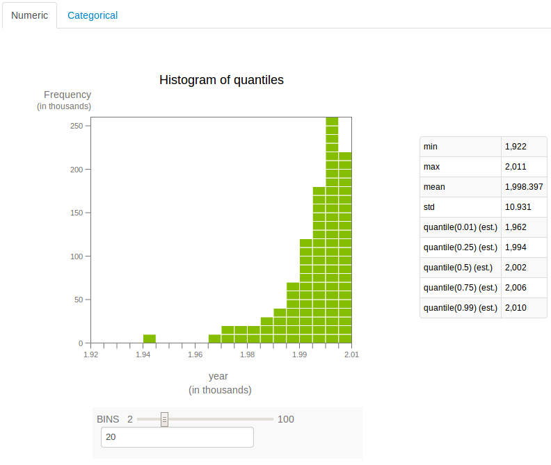
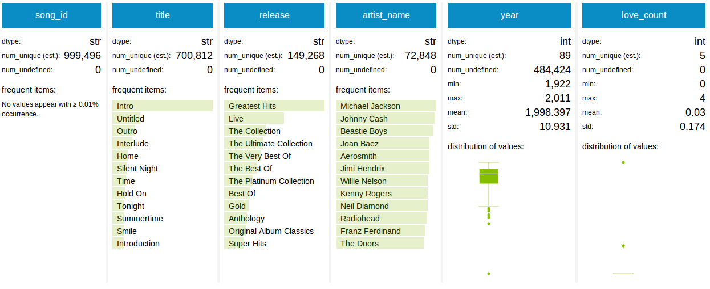
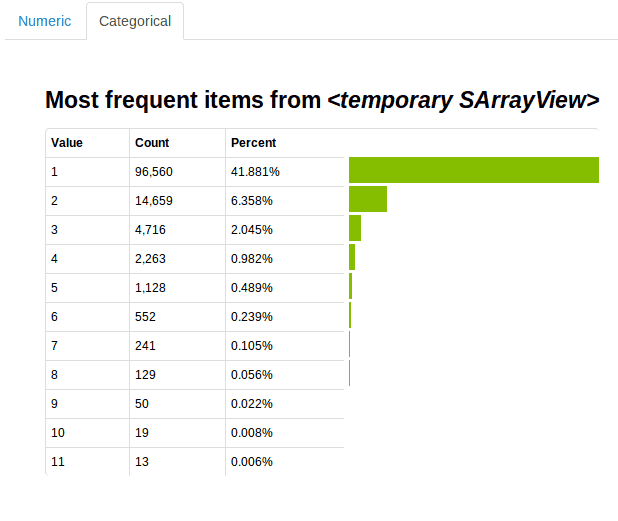

# 数据处理

数据一导入就足够清洁到可以用我们的工具包在上面执行有意义操作这种情况并不常见。
这就是文件...数据就是杂乱的。SFrames可以让你以可伸缩的方式完成数据清洗任务，
即使是在比计算机内存还大的数据集上。


#### 列选择和处理

你可能已经注意到在song metadata中存在某些song的year值为0的问题。假设我们想要将这些值
改成缺失值，以便他们不会使该列上的统计量偏斜（如`mean`或`min`）。如果我们在解析数据之前
已经知道或者我们愿意再次解析文件，我们可以将`read_csv`的参数`na_values`设置为0。或者，
我们还可以在SFrame的一列或多列上应用一个函数。下面使用Python的lambda函数将零值替换为缺失值。

```python
songs['year'] = songs['year'].apply(lambda x: None if x == 0 else x)
songs.head(5)
```
```
+--------------------+----------------------+--------------------------------+
|      song_id       |        title         |            release             |
+--------------------+----------------------+--------------------------------+
| SOQMMHC12AB0180CB8 |     Silent Night     |     Monster Ballads X-Mas      |
| SOVFVAK12A8C1350D9 |     Tanssi vaan      |       Karkuteill\xc3\xa4       |
| SOGTUKN12AB017F4F1 |  No One Could Ever   |             Butter             |
| SOBNYVR12A8C13558C | Si Vos Quer\xc3\xa9s |            De Culo             |
| SOHSBXH12A8C13B0DF |   Tangle Of Aspens   | Rene Ablaze Presents Winte ... |
+--------------------+----------------------+--------------------------------+
+------------------+------+
|   artist_name    | year |
+------------------+------+
| Faster Pussy cat | 2003 |
| Karkkiautomaatti | 1995 |
|  Hudson Mohawke  | 2006 |
|   Yerba Brava    | 2003 |
|    Der Mystic    | None |
+------------------+------+
[5 rows x 5 columns]
```

注意我们需要将结果再赋值给我们的SFrame，因为SFrame列的内容（其实是一个叫做[SArray](https://dato.com/products/create/docs/generated/graphlab.SArray.html)
的数据结构）是不可变的。SFrames可自由增减列是因为其列本质上是SArrays的引用。

这里我们使用lambda函数是因为这是实例化小函数最简单的方法。`apply`方法也可以
以命名函数（即以`def`开头的普通Python函数）为参数。只要函数有一个参数并且返
回一个值，就可以将其应用到一列上去。

我们也可以将函数应用到多列上去。假如我们需要添加一列来记录'love'在'title'列和
'artist'列出现次数之和：

```python
songs['love_count'] = songs[['title', 'artist_name']].apply(
    lambda row: sum(x.lower().split(' ').count('love') for x in row.values()))
songs.topk('love_count', k=5)
```


```
+--------------------+--------------------------------+
|      song_id       |             title              |
+--------------------+--------------------------------+
| SOMYDCX12A8AE4836B | The Love Story (Part 1) In ... |
| SONXAVM12AB017AA1D |          Document 15           |
| SOAWJOC12A8C1367A7 |       Black Black Window       |
| SOXAVWF12A8AE4922C |           One Piece            |
| SOAJRDR12A8C1383B1 |         Love Love Love         |
+--------------------+--------------------------------+
+--------------------------------+--------------------------------+------+------------+
|            release             |          artist_name           | year | love_count |
+--------------------------------+--------------------------------+------+------------+
|      Skid Row / 34 Hours       |            Skid Row            | None |     4      |
| Feels_ Feathers_ Bog and Bees  | Low Low Low La La La Love  ... | None |     3      |
|          Ends Of June          | Low Low Low La La La Love  ... | 2007 |     3      |
| Low Low Low La La La Love  ... | Low Low Low La La La Love  ... | 2007 |     3      |
|           Radio Hitz           |       Spider Murphy Gang       | None |     3      |
+--------------------------------+--------------------------------+------+------------+
[5 rows x 6 columns]
```

这里还需要注意的是：首先我们在方括号中使用列表选择了一个列子集。这通常都是有用的，
因为在这种情况下我们可以通过减少需要扫描值的数量来提高性能。当在SFrame上而不是SArray上
调用apply方法时，lambda函数的输入时一个字典，键是列名，值是行对应各列的值。

另外一个有用切常用的操作是根据类型来选择列。例如，下面代码抽取所有包含字符串的列。

```python
song[str]
```

```
Data:
+--------------------+-------------------------------+
|      song_id       |             title             |
+--------------------+-------------------------------+
| SOQMMHC12AB0180CB8 |          Silent Night         |
| SOVFVAK12A8C1350D9 |          Tanssi vaan          |
| SOGTUKN12AB017F4F1 |       No One Could Ever       |
| SOBNYVR12A8C13558C |         Si Vos Querés         |
| SOHSBXH12A8C13B0DF |        Tangle Of Aspens       |
| SOZVAPQ12A8C13B63C | Symphony No. 1 G minor "Si... |
| SOQVRHI12A6D4FB2D7 |        We Have Got Love       |
| SOEYRFT12AB018936C |       2 Da Beat Ch'yall       |
| SOPMIYT12A6D4F851E |            Goodbye            |
| SOJCFMH12A8C13B0C2 |   Mama_ mama can't you see ?  |
+--------------------+-------------------------------+
+-------------------------------+-------------------------------+
|            release            |          artist_name          |
+-------------------------------+-------------------------------+
|     Monster Ballads X-Mas     |        Faster Pussy cat       |
|          Karkuteillä          |        Karkkiautomaatti       |
|             Butter            |         Hudson Mohawke        |
|            De Culo            |          Yerba Brava          |
| Rene Ablaze Presents Winte... |           Der Mystic          |
| Berwald: Symphonies Nos. 1... |        David Montgomery       |
|   Strictly The Best Vol. 34   |       Sasha / Turbulence      |
|            Da Bomb            |           Kris Kross          |
|           Danny Boy           |          Joseph Locke         |
| March to cadence with the ... | The Sun Harbor's Chorus-Do... |
+-------------------------------+-------------------------------+
```

Now, you may not feel comfortable transforming a column without inspecting more
than the first 10 rows of it, as we did with the `year` column. To quickly get
a summary of the column, we can do:

就像我们在`year`列上的变换操作一样，现在你可能会对不检查前10行之外的数据就对一列执行变换操作感觉不放心。
我们可以通过如下方式快速获取一列的概要信息：

```python
songs['year'].sketch_summary()
```

```
+--------------------+---------------+----------+
|        item        |     value     | is exact |
+--------------------+---------------+----------+
|       Length       |    1000000    |   Yes    |
|        Min         |      0.0      |   Yes    |
|        Max         |     2011.0    |   Yes    |
|        Mean        |  1030.325652  |   Yes    |
|        Sum         |  1030325652.0 |   Yes    |
|      Variance      | 997490.582407 |   Yes    |
| Standard Deviation | 998.744503067 |   Yes    |
|  # Missing Values  |       0       |   Yes    |
|  # unique values   |       90      |    No    |
+--------------------+---------------+----------+

Most frequent items:
+-------+--------+-------+-------+-------+-------+-------+-------+-------+-------+
| value |   0    |  2007 |  2006 |  2005 |  2008 |  2009 |  2004 |  2003 |  2002 |
+-------+--------+-------+-------+-------+-------+-------+-------+-------+-------+
| count | 484424 | 39414 | 37546 | 34960 | 34770 | 31051 | 29618 | 27389 | 23472 |
+-------+--------+-------+-------+-------+-------+-------+-------+-------+-------+
+-------+
|  2001 |
+-------+
| 21604 |
+-------+

Quantiles:
+-----+-----+-----+-----+--------+--------+--------+--------+--------+
|  0% |  1% |  5% | 25% |  50%   |  75%   |  95%   |  99%   |  100%  |
+-----+-----+-----+-----+--------+--------+--------+--------+--------+
| 0.0 | 0.0 | 0.0 | 0.0 | 1970.0 | 2002.0 | 2008.0 | 2009.0 | 2011.0 |
+-----+-----+-----+-----+--------+--------+--------+--------+--------+

```

看来除了0之外没有其他不合法的年份值了。概要信息将值分成了"exact"（准确）和"approximate"（近似）两类。
近似值当然也有可能作为准确值返回，但是对于概要信息，我们使用近似值来确保对于大型数据集的探索是可扩展的（？）。
我们使用的方法仅对指定列的数据进行一遍扫描，并且每一个操作都有严格定义的范围指明结果会在多大程度上是有误的。
具体参见[API Reference](https://dato.com/products/create/docs/generated/graphlab.Sketch.html)。

使用概要信息中最常出现的项及分位数信息，你几乎可以想象出年份的分布情况，其中最大一部分是20世纪前十年（？）。
幸运的是我们可以不仅仅是在头脑中数据分布，GraphLab Canvas提供了SFrame及其他数据结构之上的可视化，
在[可视化](visualization.md)一节将深入介绍GraphLab Canvas。下面的例子将这些近似分位数以直方图的形式可视化：

```
songs['year'].show()
```

[](images/sframe_user_guide_1_histogram.png)


我们已经了一些探索，转换和特征生成，让我们继续花些时间过滤我们后面用不到的值吧。例如，
我们可能只需要有确切日期的歌曲，基本的过滤操作如下：

```python
dated_songs = songs[songs['year'] != None]
dated_songs
```

```
+--------------------+--------------------------------+
|      song_id       |             title              |
+--------------------+--------------------------------+
| SOQMMHC12AB0180CB8 |          Silent Night          |
| SOVFVAK12A8C1350D9 |          Tanssi vaan           |
| SOGTUKN12AB017F4F1 |       No One Could Ever        |
| SOBNYVR12A8C13558C |      Si Vos Quer\xc3\xa9s      |
| SOEYRFT12AB018936C |       2 Da Beat Ch'yall        |
| SOYGNWH12AB018191E |         L'antarctique          |
| SOLJTLX12AB01890ED |       El hijo del pueblo       |
| SOMPVQB12A8C1379BB |             Pilots             |
| SOSDCFG12AB0184647 |              006               |
| SOBARPM12A8C133DFF | (Looking For) The Heart Of ... |
+--------------------+--------------------------------+
+--------------------------------+------------------+------+------------+
|            release             |   artist_name    | year | love_count |
+--------------------------------+------------------+------+------------+
|     Monster Ballads X-Mas      | Faster Pussy cat | 2003 |     0      |
|       Karkuteill\xc3\xa4       | Karkkiautomaatti | 1995 |     0      |
|             Butter             |  Hudson Mohawke  | 2006 |     0      |
|            De Culo             |   Yerba Brava    | 2003 |     0      |
|            Da Bomb             |    Kris Kross    | 1993 |     0      |
|   Des cobras des tarentules    | 3 Gars Su'l Sofa | 2007 |     0      |
| 32 Grandes \xc3\x89xitos  CD 2 |  Jorge Negrete   | 1997 |     0      |
|           The Loyal            |    Tiger Lou     | 2005 |     0      |
|       Lena 20 \xc3\x85r        | Lena Philipsson  | 1998 |     0      |
|           Cover Girl           |   Shawn Colvin   | 1994 |     0      |
+--------------------------------+------------------+------+------------+
[? rows x 6 columns]
Note: Only the head of the SFrame is printed. This SFrame is lazily evaluated.
You can use len(sf) to force materialization.
```

输出信息很好的解释了过滤操作过程中发生了什么。对不需立即使用的结果SFrames会暂不执行操作，
这种情况下，如果你看了前几行的结果发现过滤操作不需要再执行了，GraphLab就不会浪费计算时间，
但是验证缺失值的确被移除了很重要。我们确实移除了484424行，所以我们强制新的SFrame具体化（即全部执行？）。

```python
len(dated_songs)
```

```
515576
```

为什么这个过滤语法会起效？我们实际上是在方括号中放置了一个SArray，应用于SArray上的
比较操作符返回一个等长的bool型SArray。如下所示：

```python
songs['year'] != None
```

```
dtype: int
Rows: 1000000
[1, 1, 1, 1, 0, 0, 0, 1, 0, 0, 1, 1, 0, 1, 0, 1, 1, 1, 1, 0, 0, 0, 1, 1, 0, 0, 1, 1, 0, 0, 0, 0, 0, 1, 1, 1, 0, 1, 0, 1, 0, 1, 0, 1, 1, 1, 0, 1, 0, 0, 0, 0, 1, 1, 1, 0, 0, 1, 0, 0, 1, 1, 0, 1, 1, 1, 0, 0, 0, 1, 0, 0, 1, 0, 1, 1, 0, 0, 0, 0, 1, 0, 0, 1, 1, 0, 1, 0, 1, 0, 0, 0, 1, 1, 1, 1, 0, 1, 1, 1, ... ]
```

我们可能会需要使用两个以上比较操作符，这时我们需要将每一个比较语句放置在一个小括号里，
并使用按位布尔逻辑操作符连接，因为Python不允许逻辑操作符重载。也许我们会使用这个数据
搭建一个推荐系统，我们可能会只使用播放次数合理的数据：

```python
reasonable_usage = usage_data[(usage_data['listen_count'] >= 10) & (usage_data['listen_count'] <= 500)]
len(reasonable_usage)
```

```
114026
```

你也可以写一个lambda函数传递给`filter`函数做参数来过滤，
具体请参考[API Reference](https://dato.com/products/create/docs/generated/graphlab.SArray.filter.html#graphlab.SArray.filter).

#### Joins and Aggregation

Another important way to filter a dataset is to get rid of duplicate data.  A
nice way to search for duplicate data is to visualize the SFrame using GraphLab
Canvas.

```
songs.show()
```

[](images/sframe_user_guide_1_histogram.png)


It appears our `song_id` is not completely unique.  This would make merging the
`songs` and `usage_data` SFrames error-prone if all we want to do is add song
title information to the existing usage data.  In this particular dataset, these
repeat songs are included because they may have been released on several
different albums (movie soundtracks, radio singles, etc.).  If we do not care
about which album release is included in the dataset, we can filter those
duplicates like this:


```python
other_cols = songs.column_names()
other_cols.remove('song_id')
agg_list = [gl.aggregate.SELECT_ONE(i) for i in other_cols]
unique_songs = songs.groupby('song_id', dict(zip(other_cols, agg_list)))
```

This code block needs some further explanation.  It is centered around calling
`groupby` with the `SELECT_ONE` aggregator.  This selects a random
representative row from each group.  You must explicitly denote which columns
will use this aggregator, so the list comprehension gathers all other columns
than the one we are grouping by and uses the `SELECT_ONE` aggregator for each
one.  When used like this, `SELECT_ONE` will use the same random row for each
column.  This is great if it is not important which of the duplicates you pick.
If it is, another aggregator like `MIN` or `MAX` may be in order.

Suppose we actually want to see the songs that have the highest play count?  Now
we can correctly group each song and aggregate its listen count, and then join
the result to the song metadata to see the song titles.

```python
tmp = usage_data.groupby(['song_id'], {'total_listens': gl.aggregate.SUM('listen_count'),
                                       'num_unique_users': gl.aggregate.COUNT('user_id')})
tmp.join(songs, ['song_id']).topk('total_listens')
```


```
+--------------------+------------------+---------------+
|      song_id       | num_unique_users | total_listens |
+--------------------+------------------+---------------+
| SOBONKR12A58A7A7E0 |       6412       |     54136     |
| SOAUWYT12A81C206F1 |       7032       |     49253     |
| SOSXLTC12AF72A7F54 |       6145       |     41418     |
| SOEGIYH12A6D4FC0E3 |       5385       |     31153     |
| SOFRQTD12A81C233C0 |       8277       |     31036     |
| SOAXGDH12A8C13F8A1 |       6949       |     26663     |
| SONYKOW12AB01849C9 |       5841       |     22100     |
| SOPUCYA12A8C13A694 |       3526       |     21019     |
| SOUFTBI12AB0183F65 |       2887       |     19645     |
| SOVDSJC12A58A7A271 |       2866       |     18309     |
+--------------------+------------------+---------------+
+--------------------------------+--------------------------------+
|             title              |            release             |
+--------------------------------+--------------------------------+
|         You're The One         |       If There Was A Way       |
|              Undo              |        Vespertine Live         |
|            Revelry             |       Only By The Night        |
| Horn Concerto No. 4 in E f ... | Mozart - Eine kleine Nacht ... |
|         Sehr kosmisch          |       Musik von Harmonia       |
| Dog Days Are Over (Radio Edit) | Now That's What I Call Mus ... |
|            Secrets             |           Waking Up            |
|             Canada             |        The End Is Here         |
|            Invalid             |         Fermi Paradox          |
|        Ain't Misbehavin        |           Summertime           |
+--------------------------------+--------------------------------+
+--------------------------------+------+------------+
|          artist_name           | year | love_count |
+--------------------------------+------+------------+
|         Dwight Yoakam          | 1990 |     0      |
|          Bj\xc3\xb6rk          | 2001 |     0      |
|         Kings Of Leon          | 2008 |     0      |
| Barry Tuckwell/Academy of  ... | None |     0      |
|            Harmonia            | None |     0      |
|     Florence + The Machine     | None |     0      |
|          OneRepublic           | 2009 |     0      |
|        Five Iron Frenzy        | None |     0      |
|            Tub Ring            | 2002 |     0      |
|           Sam Cooke            | None |     0      |
+--------------------------------+------+------------+
[10 rows x 8 columns]
```


The `usage_data` table is already in a great format for feeding to a recommender
algorithm as it has user and song identifiers, and some form of a metric (number
of listens) to rate how much the user liked the song.  The problem here is that
users that listened to a song a lot would skew the recommendations.  At some
point, once a user plays a song enough times, you know they really like it.
Perhaps we could translate the `listen_count` into a rating instead.  Here is a simple way to do it:

```python
s = usage_data['listen_count'].sketch_summary()
import numpy
buckets = numpy.linspace(s.quantile(.005), s.quantile(.995), 5)
def bucketize(x):
    cur_bucket = 0
    for i in range(0,5):
        cur_bucket += 1
        if x <= buckets[i]:
            break
    return cur_bucket
usage_data['rating'] = usage_data['listen_count'].apply(bucketize)
usage_data
```

```
Columns:
        user_id str
        song_id str
        listen_count    int
        rating  int

Rows: 2000000

Data:
+--------------------------------+--------------------+--------------+--------+
|            user_id             |      song_id       | listen_count | rating |
+--------------------------------+--------------------+--------------+--------+
| b80344d063b5ccb3212f76538f ... | SOAKIMP12A8C130995 |      1       |   1    |
| b80344d063b5ccb3212f76538f ... | SOBBMDR12A8C13253B |      2       |   2    |
| b80344d063b5ccb3212f76538f ... | SOBXHDL12A81C204C0 |      1       |   1    |
| b80344d063b5ccb3212f76538f ... | SOBYHAJ12A6701BF1D |      1       |   1    |
| b80344d063b5ccb3212f76538f ... | SODACBL12A8C13C273 |      1       |   1    |
| b80344d063b5ccb3212f76538f ... | SODDNQT12A6D4F5F7E |      5       |   2    |
| b80344d063b5ccb3212f76538f ... | SODXRTY12AB0180F3B |      1       |   1    |
| b80344d063b5ccb3212f76538f ... | SOFGUAY12AB017B0A8 |      1       |   1    |
| b80344d063b5ccb3212f76538f ... | SOFRQTD12A81C233C0 |      1       |   1    |
| b80344d063b5ccb3212f76538f ... | SOHQWYZ12A6D4FA701 |      1       |   1    |
|              ...               |        ...         |     ...      |  ...   |
+--------------------------------+--------------------+--------------+--------+
[2000000 rows x 4 columns]
Note: Only the head of the SFrame is printed.
You can use print_rows(num_rows=m, num_columns=n) to print more rows and columns.
```


#### Working with Complex Types

SArrays are strongly-typed and some operations only work on certain types. Two
types deserve some special consideration in this user guide: `list` and `dict`.
These types can hold values of any type supported by SArrays, including
themselves. So you can have an SFrame with a column of dictionaries that each
have values that are lists of lists of dicts with mixed strings and
integers... anyway, you get the idea!

The dataset we're working with right now does not have any of these types, so we
can show how to convert one or several columns to one of these iterable types.
For instance, suppose we want a list of all albums with a list of each song that
was on the album.  We would obtain this list from our metadata like this:

```python
albums = songs.groupby(['release','artist_name'], {'tracks': gl.aggregate.CONCAT('title'),
                                                   'years': gl.aggregate.CONCAT('year')})
albums
```


```
+--------------------------------+--------------------------------+
|          artist_name           |            release             |
+--------------------------------+--------------------------------+
|          Veruca Salt           |     Eight Arms To Hold You     |
|  Les Compagnons De La Chanson  | Heritage - Le Chant De Mal ... |
| Nelly / Fat Joe / Young Tr ... |             Sweat              |
|           The Grouch           |       My Baddest B*tches       |
|         Ozzy Osbourne          | Diary of a madman / Bark a ... |
|        Peter Hunnigale         |      Reggae Hits Vol. 32       |
|         Burning Spear          |      Studio One Classics       |
|              Bond              |        New Classix 2008        |
| Lee Coombs feat. Katherine ... |            Control             |
|         Stevie Wonder          |    Songs In The Key Of Life    |
+--------------------------------+--------------------------------+
+--------------------------------+--------------------------------+
|             tracks             |             years              |
+--------------------------------+--------------------------------+
| [\'One Last Time\', \'With ... | array('d', [1997.0, 1997.0 ... |
| ['I Commedianti', 'Il Est  ... |              None              |
|       ['Grand Hang Out']       |      array('d', [2004.0])      |
| ['Silly Putty (Zion I Feat ... |      array('d', [1999.0])      |
| ["You Can\'t Kill Rock And ... | array('d', [1981.0, 1983.0 ... |
|        ['Weeks Go By']         |              None              |
|        ['Rocking Time']        |      array('d', [1973.0])      |
|   ['Allegretto', 'Kashmir']    |              None              |
| ['Control (10Rapid Remix)' ... |              None              |
| ['Ngiculela-Es Una Histori ... |      array('d', [1976.0])      |
|              ...               |              ...               |
+--------------------------------+--------------------------------+
[230558 rows x 4 columns]
Note: Only the head of the SFrame is printed.
You can use print_rows(num_rows=m, num_columns=n) to print more rows and columns.
```


The [CONCAT](https://dato.com/products/create/docs/graphlab.data_structures.html#module-graphlab.aggregate)
aggregator simply creates a list of all values in the given column for each
group.  I included the year for debugging purposes, since I didn't know if the
invariant of "every song on the same release has the same year" was true in
this dataset.  Even looking at the first row, this is clearly not true:

```python
albums[0]
```


```
{'artist_name': 'Veruca Salt',
 'release': 'Eight Arms To Hold You',
 'tracks': ['With David Bowie',
  'One Last Time',
  'The Morning Sad',
  'Awesome',
  'Stoneface',
  "Don't Make Me Prove It",
  'Straight',
  'Earthcrosser',
  'Benjamin',
  'Volcano Girls',
  'Shutterbug',
  'Sound Of The Bell',
  'Loneliness Is Worse',
  'Venus Man Trap'],
  'years': array('d', [1997.0, 1997.0, 1997.0, 1997.0, 1997.0, 1997.0, 1994.0, 1997.0, 1997.0, 1997.0, 1997.0, 1997.0, 1997.0, 1997.0])}
```


In light of this complication, and for demonstration purposes, let's have our
'tracks' column contain dictionaries instead, where the key is the year and the
value is a list of tracks.

```python
albums = songs.groupby(['release','artist_name','year'], {'tracks':gl.aggregate.CONCAT('title')})
albums = albums.unstack(column=['year','tracks'], new_column_name='track_dict')
albums
```


```
+--------------------------------+--------------------------------+
|          artist_name           |            release             |
+--------------------------------+--------------------------------+
|          Veruca Salt           |     Eight Arms To Hold You     |
|  Les Compagnons De La Chanson  | Heritage - Le Chant De Mal ... |
| Nelly / Fat Joe / Young Tr ... |             Sweat              |
|           The Grouch           |       My Baddest B*tches       |
|         Ozzy Osbourne          | Diary of a madman / Bark a ... |
|        Peter Hunnigale         |      Reggae Hits Vol. 32       |
|         Burning Spear          |      Studio One Classics       |
|              Bond              |        New Classix 2008        |
| Lee Coombs feat. Katherine ... |            Control             |
|         Stevie Wonder          |    Songs In The Key Of Life    |
+--------------------------------+--------------------------------+
+--------------------------------+
|           track_dict           |
+--------------------------------+
| {1994: [\'Straight\'], 199 ... |
|              None              |
|   {2004: ['Grand Hang Out']}   |
|     {1999: ['Simple Man']}     |
| {1986: [\'Secret Loser\'], ... |
|              None              |
|    {1973: ['Rocking Time']}    |
|              None              |
|              None              |
| {1976: ['Have A Talk With  ... |
|              ...               |
+--------------------------------+
[230558 rows x 3 columns]
Note: Only the head of the SFrame is printed.
You can use print_rows(num_rows=m, num_columns=n) to print more rows and columns.
```


The `unstack` function is essentially a convenience function for calling
`groupby` on all other columns with the `CONCAT` aggregator.  This operation
can be undone with `stack`, which I won't take time to show in detail.

With our data organized this way, we can get some statistics on how many albums
have this oddity and see that it's actually somewhat prevalent for this to
occur:

```python
albums['num_years'] = albums['track_dict'].item_length()
albums['num_years'].show()
```


[](images/sframe_user_guide_3_categorical.png)


We can still recover the full track listing with some dict operations, so
suppose we want both a `list` and a `dict` representation of the tracks.

```python
albums['track_list'] = albums['track_dict'].dict_values()
albums
```


```
+--------------------------------+--------------------------------+
|          artist_name           |            release             |
+--------------------------------+--------------------------------+
|          Veruca Salt           |     Eight Arms To Hold You     |
|  Les Compagnons De La Chanson  | Heritage - Le Chant De Mal ... |
| Nelly / Fat Joe / Young Tr ... |             Sweat              |
|           The Grouch           |       My Baddest B*tches       |
|         Ozzy Osbourne          | Diary of a madman / Bark a ... |
|        Peter Hunnigale         |      Reggae Hits Vol. 32       |
|         Burning Spear          |      Studio One Classics       |
|              Bond              |        New Classix 2008        |
| Lee Coombs feat. Katherine ... |            Control             |
|         Stevie Wonder          |    Songs In The Key Of Life    |
+--------------------------------+--------------------------------+
+--------------------------------+-----------+--------------------------------+
|           track_dict           | num_years |           track_list           |
+--------------------------------+-----------+--------------------------------+
| {1994: [\'Straight\'], 199 ... |     2     | [[\'Straight\'], [\'With D ... |
|              None              |    None   |              None              |
|   {2004: ['Grand Hang Out']}   |     1     |      [['Grand Hang Out']]      |
|     {1999: ['Simple Man']}     |     1     |        [['Simple Man']]        |
| {1986: [\'Secret Loser\'], ... |     3     | [["You Can\'t Kill Rock An ... |
|              None              |    None   |              None              |
|    {1973: ['Rocking Time']}    |     1     |       [['Rocking Time']]       |
|              None              |    None   |              None              |
|              None              |    None   |              None              |
| {1976: ['Have A Talk With  ... |     1     |   [['Have A Talk With God']]   |
|              ...               |    ...    |              ...               |
+--------------------------------+-----------+--------------------------------+
[230558 rows x 5 columns]
Note: Only the head of the SFrame is printed.
You can use print_rows(num_rows=m, num_columns=n) to print more rows and columns.
```


We have almost recovered our old column, but we have a list of lists instead of
just a single list.  Fixing that is a simple `apply` away:

```python
import itertools
albums['track_list'] = albums['track_list'].apply(lambda x: list(itertools.chain(*x)))
albums
```


```
+--------------------------------+--------------------------------+
|          artist_name           |            release             |
+--------------------------------+--------------------------------+
|          Veruca Salt           |     Eight Arms To Hold You     |
|  Les Compagnons De La Chanson  | Heritage - Le Chant De Mal ... |
| Nelly / Fat Joe / Young Tr ... |             Sweat              |
|           The Grouch           |       My Baddest B*tches       |
|         Ozzy Osbourne          | Diary of a madman / Bark a ... |
|        Peter Hunnigale         |      Reggae Hits Vol. 32       |
|         Burning Spear          |      Studio One Classics       |
|              Bond              |        New Classix 2008        |
| Lee Coombs feat. Katherine ... |            Control             |
|         Stevie Wonder          |    Songs In The Key Of Life    |
+--------------------------------+--------------------------------+
+--------------------------------+-----------+--------------------------------+
|           track_dict           | num_years |           track_list           |
+--------------------------------+-----------+--------------------------------+
| {1994: [\'Straight\'], 199 ... |     2     | [\'Straight\', \'With Davi ... |
|              None              |    None   |              None              |
|   {2004: ['Grand Hang Out']}   |     1     |       ['Grand Hang Out']       |
|     {1999: ['Simple Man']}     |     1     |         ['Simple Man']         |
| {1986: [\'Secret Loser\'], ... |     3     | ["You Can\'t Kill Rock And ... |
|              None              |    None   |              None              |
|    {1973: ['Rocking Time']}    |     1     |        ['Rocking Time']        |
|              None              |    None   |              None              |
|              None              |    None   |              None              |
| {1976: ['Have A Talk With  ... |     1     |    ['Have A Talk With God']    |
|              ...               |    ...    |              ...               |
+--------------------------------+-----------+--------------------------------+
[230558 rows x 5 columns]
Note: Only the head of the SFrame is printed.
You can use print_rows(num_rows=m, num_columns=n) to print more rows and columns.
```


We can also filter elements from within a list or dictionary.  Here is how to
remove all songs made in 1994 or 1999:

```python
albums['track_dict'] = albums['track_dict'].dict_trim_by_keys([1994, 1999])


albums
```


```
+--------------------------------+--------------------------------+
|          artist_name           |            release             |
+--------------------------------+--------------------------------+
|          Veruca Salt           |     Eight Arms To Hold You     |
|  Les Compagnons De La Chanson  | Heritage - Le Chant De Mal ... |
| Nelly / Fat Joe / Young Tr ... |             Sweat              |
|           The Grouch           |       My Baddest B*tches       |
|         Ozzy Osbourne          | Diary of a madman / Bark a ... |
|        Peter Hunnigale         |      Reggae Hits Vol. 32       |
|         Burning Spear          |      Studio One Classics       |
|              Bond              |        New Classix 2008        |
| Lee Coombs feat. Katherine ... |            Control             |
|         Stevie Wonder          |    Songs In The Key Of Life    |
+--------------------------------+--------------------------------+
+--------------------------------+-----------+--------------------------------+
|           track_dict           | num_years |           track_list           |
+--------------------------------+-----------+--------------------------------+
| {1997: [\'With David Bowie ... |     2     | [\'Straight\', \'With Davi ... |
|              None              |    None   |              None              |
|   {2004: ['Grand Hang Out']}   |     1     |       ['Grand Hang Out']       |
|               {}               |     1     |         ['Simple Man']         |
| {1986: [\'Secret Loser\'], ... |     3     | ["You Can\'t Kill Rock And ... |
|              None              |    None   |              None              |
|    {1973: ['Rocking Time']}    |     1     |        ['Rocking Time']        |
|              None              |    None   |              None              |
|              None              |    None   |              None              |
| {1976: ['Have A Talk With  ... |     1     |    ['Have A Talk With God']    |
|              ...               |    ...    |              ...               |
+--------------------------------+-----------+--------------------------------+
[230558 rows x 5 columns]
Note: Only the head of the SFrame is printed.
You can use print_rows(num_rows=m, num_columns=n) to print more rows and columns.
```


Since dictionaries are good for item lookups, we can filter by elements we
find in dictionaries.  Here is a query that filters  albums by whether any of
their songs came out in 1965:

```python
albums[albums['track_dict'].dict_has_any_keys(1965)]
```


```
+----------------------------+--------------------------------+
|        artist_name         |            release             |
+----------------------------+--------------------------------+
| Jr. Walker & The All Stars | The Motown Story: The Sixties  |
|        The Seekers         | The Best Sixties Album In  ... |
| Jr. Walker & The All Stars | Sparks Present Motown Made ... |
|          The Who           |           Who's Next           |
|        Bobby Vinton        |    The Best Of Bobby Vinton    |
|     Righteous Brothers     |         The Collection         |
|       Little Milton        |          Chess Blues           |
|          The Who           |          Singles Box           |
|       Dionne Warwick       |           Here I Am            |
|        Albert Ayler        | Nuits De La Fondation Maeg ... |
+----------------------------+--------------------------------+
+--------------------------------+-----------+--------------------------------+
|           track_dict           | num_years |           track_list           |
+--------------------------------+-----------+--------------------------------+
|      {1965: ['Shotgun']}       |     1     |          ['Shotgun']           |
| {1965: ['The Carnival Is O ... |     1     |    ['The Carnival Is Over']    |
|    {1965: ["Cleo\'s Back"]}    |     1     |        ["Cleo\'s Back"]        |
| {1995: ["I Don\'t Even Kno ... |     4     | [\'My Generation\', \'Behi ... |
| {1991: [\'Please Love Me F ... |     6     | [\'Roses Are Red (My Love) ... |
| {2006: ['Let The Good Time ... |     4     | ['Justine', 'Stagger Lee', ... |
| {1965: ["We\'re Gonna Make ... |     1     |    ["We\'re Gonna Make It"]    |
|  {1965: ['Shout And Shimmy']}  |     1     |      ['Shout And Shimmy']      |
| {1965: ['How Can I Hurt Yo ... |     1     | ['How Can I Hurt You? (LP  ... |
| {1969: ['Music Is The Heal ... |     4     | ['Spirits', 'Spirits Rejoi ... |
+--------------------------------+-----------+--------------------------------+
[? rows x 5 columns]
Note: Only the head of the SFrame is printed. This SFrame is lazily evaluated.
You can use len(sf) to force materialization.
```


Converting to a `list` or `dict` doesn't need to group by the rest of the values in
the row.  If for some reason you want to turn this into a table with one column
and all values packed into a list, you can!

```python
big_list = albums.pack_columns(albums.column_names())
big_list
```

```
+--------------------------------+
|               X1               |
+--------------------------------+
| [\'Veruca Salt\', \'Eight  ... |
| ['Les Compagnons De La Cha ... |
| ['Nelly / Fat Joe / Young  ... |
| ['The Grouch', 'My Baddest ... |
| [\'Ozzy Osbourne\', \'Diar ... |
| ['Peter Hunnigale', 'Regga ... |
| ['Burning Spear', 'Studio  ... |
| ['Bond', 'New Classix 2008 ... |
| ['Lee Coombs feat. Katheri ... |
| ['Stevie Wonder', 'Songs I ... |
|              ...               |
+--------------------------------+
[230558 rows x 1 columns]
Note: Only the head of the SFrame is printed.
You can use print_rows(num_rows=m, num_columns=n) to print more rows and columns.
```

The `unpack` function accomplishes the reverse task.  These examples may be a
bit contrived, but these functions are very useful when working with
unstructured data like text, as you will be able to see in the [Text Analysis](../text/analysis.md)
chapter of this guide.

To find out more, check out the [API Reference for SFrames](https://dato.com/products/create/docs/generated/graphlab.SFrame.html) and the [hands-on exercises](exercises.md) at the end of the chapter.
